# Cryptocurrencies

## Overview of the Project
The purpose of this project is to analyze cryptocurrency dataset and create a report that includes what cryptocurrencies are on the trading market and how they could be grouped to create a classification system for investment purposes. For this analysis we will use unsupervised machine learning on cryptocurrency dataset [crypto_data from CryptoCompare](Resources/crypto_data.csv).

## Deliverables for the Project
- Deliverable 1: Preprocessing the Data for PCA
- Deliverable 2: Reducing Data Dimensions Using PCA
- Deliverable 3: Clustering Cryptocurrencies Using K-means
- Deliverable 4: Visualizing Cryptocurrencies Results

## Results
### Deliverable 1: Preprocessing the Data for PCA
- The following five preprocessing steps have been performed on the crypto_df DataFrame:
  - All cryptocurrencies that are not being traded are removed
  - The IsTrading column is dropped
  - All the rows that have at least one null value are removed
  - All the rows that do not have coins being mined are removed
  - The CoinName column is dropped

   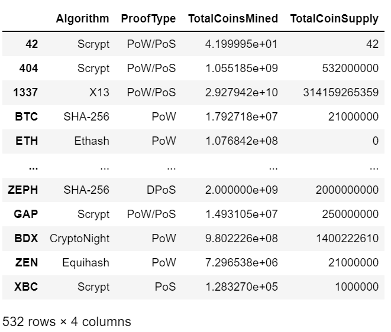

- A new DataFrame is created that stores all cryptocurrency names from the CoinName column and retains the index from the crypto_df DataFrame

    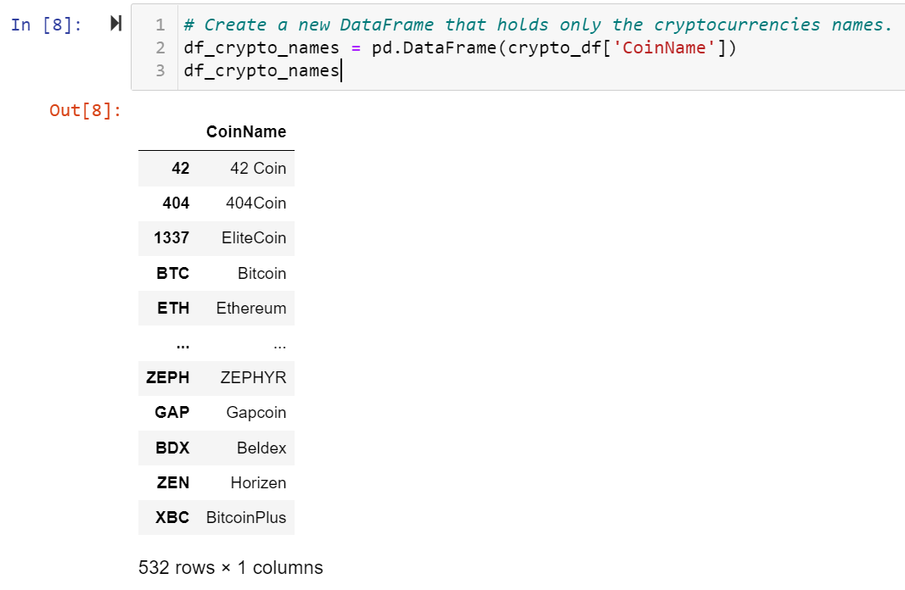

- The get_dummies() method is used to create variables for the text features, which are then stored in a new DataFrame, X 

    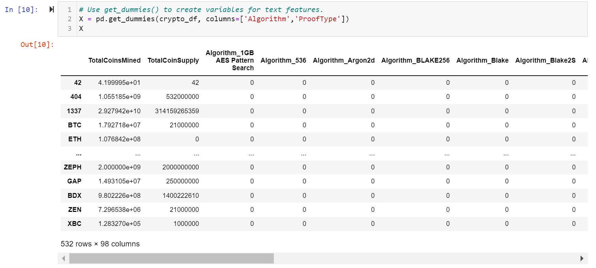

- The features from the X DataFrame have been standardized using the StandardScaler fit_transform() function

    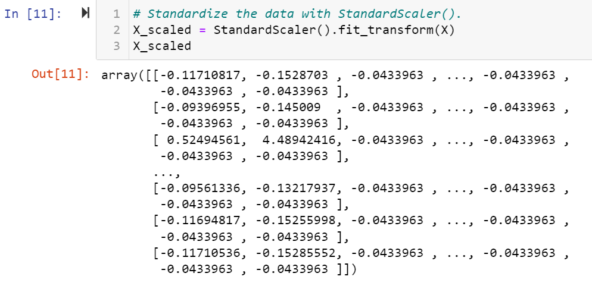

### Deliverable 2: Reducing Data Dimensions Using PCA
- The PCA algorithm reduces the dimensions of the X DataFrame down to three principal components
- The pcs_df DataFrame is created and has the following three columns, PC 1, PC 2, and PC 3, and has the index from the crypto_df DataFrame

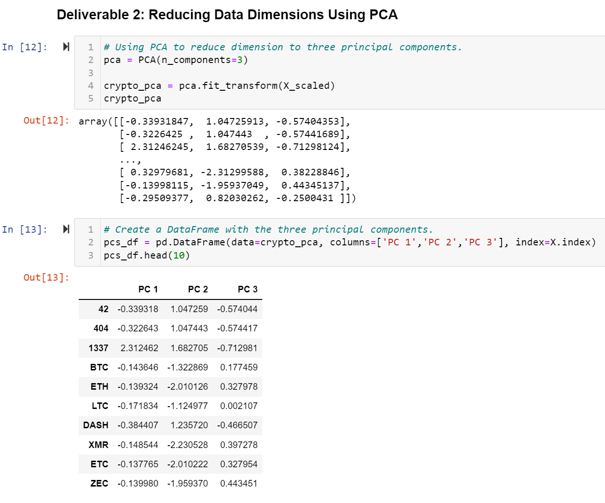

### Deliverable 3: Clustering Cryptocurrencies Using K-means
- The K-means algorithm is used to cluster the cryptocurrencies using the PCA data, where the following steps have been completed:
  - An elbow curve is created using hvPlot to find the best value for K

    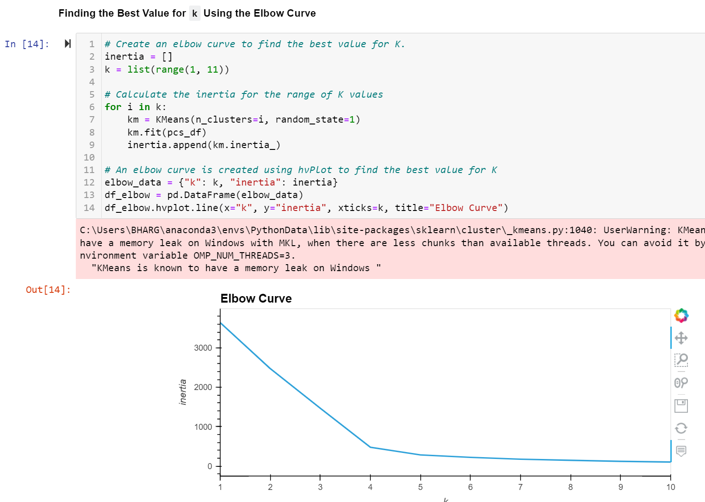

  - Predictions are made on the K clusters of the cryptocurrencies’ data

    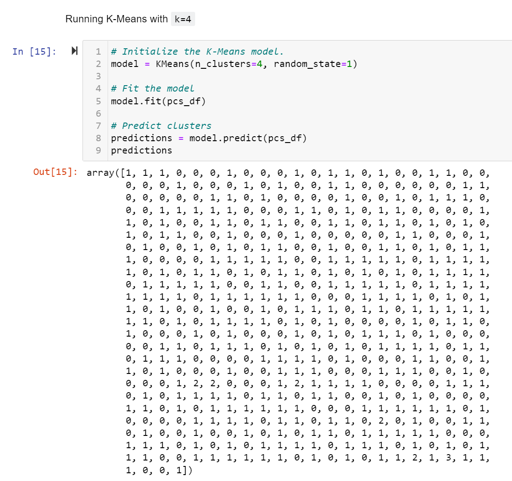

  - A new DataFrame is created with the same index as the crypto_df DataFrame and has the following columns: 
    - Algorithm, ProofType, TotalCoinsMined, TotalCoinSupply, PC 1, PC 2, PC 3, CoinName, and Class

    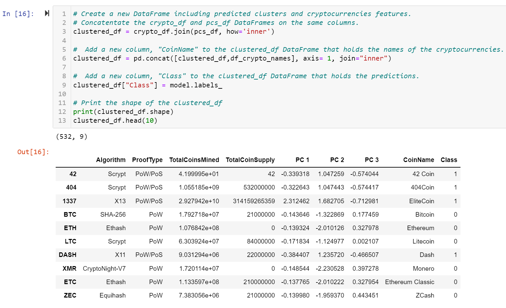

### Deliverable 4: Visualizing Cryptocurrencies Results
- The clusters are plotted using a 3D scatter plot, and each data point shows the CoinName and Algorithm on hover

    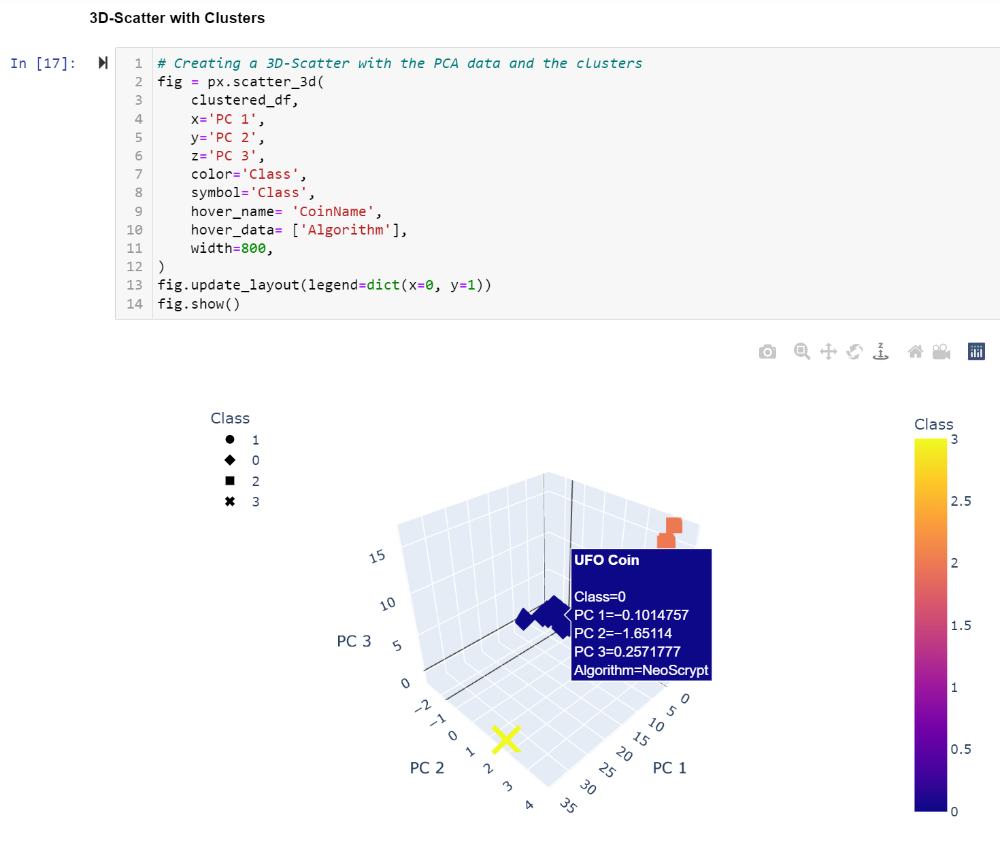

- A table with tradable cryptocurrencies is created using the hvplot.table() function

    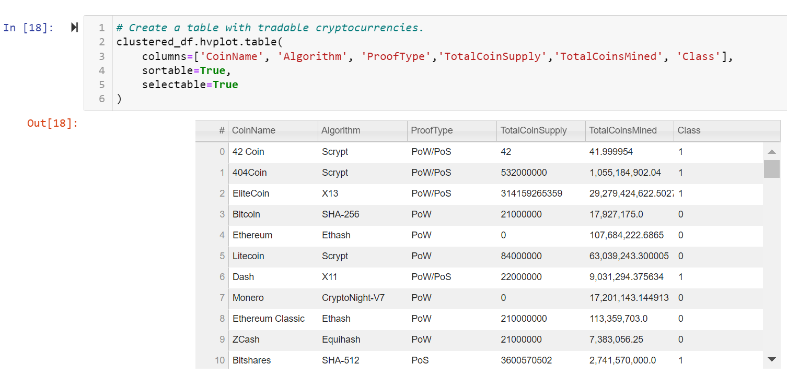

- The total number of tradable cryptocurrencies is printed

    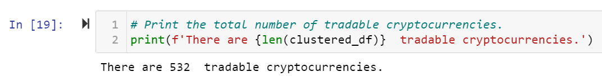

- A DataFrame is created that contains the clustered_df DataFrame index, the scaled data, and the CoinName and Class columns
  
    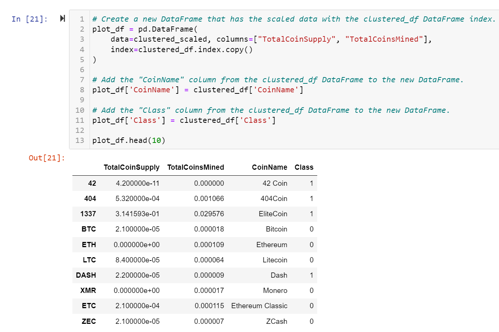

- A hvplot scatter plot is created where the X-axis is "TotalCoinsMined", the Y-axis is "TotalCoinSupply", the data is ordered by "Class", and it shows the CoinName when you hover over the data point 
    
    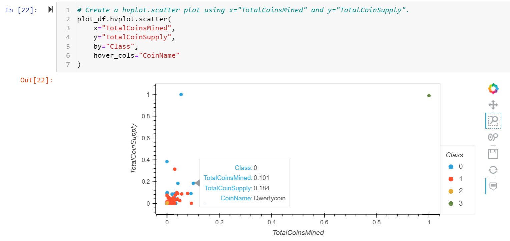

## Resources
- Dataset: [crypto_data.csv](Resources/crypto_data.csv)
- Technologies used:
  - Python
  - Pandas
  - SKLearn
  - hvplot
  - Jupyter Notebook
  - Unsupervised Machine Learning